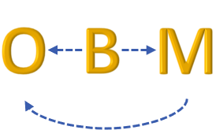

<!-- Improved compatibility of back to top link: See: https://github.com/othneildrew/Best-README-Template/pull/73 -->
<a name="readme-top"></a>
[![Contributors][contributors-shield]][contributors-url]
[![Forks][forks-shield]][forks-url]
[![Stargazers][stars-shield]][stars-url]
[![Issues][issues-shield]][issues-url]
[![License][license-shield]][license-url]
[![LinkedIn][linkedin-shield]][linkedin-url]


<!-- PROJECT LOGO -->
<br />
<div align="center">
  <a href="https://github.com/jdoerr3/NIST-OBM-Translator">
    
  </a>

<h3 align="center">Ontological Behavior Modeling SysML Translator</h3>

  <p align="center">
    This project extends the state of the art in systems model analysis with a focus on behavior models in the open standard Systems Modeling Language (SysML), a systems engineering extension of the Unified Modeling Language (UML) for software specification. The software ingests SysML models in the Object Management Group's (OMG's) open standard for for SysML file formats, XMI, and translates them into logical models in Alloy Analyzer, enabling static semantic analysis of the model.

NOTE: This README is under construction 
    <br />
    <a href="https://github.com/ontological-behavior-modeling/NIST-OBM-Translator/wiki"><strong>Explore the docs »</strong></a>
    <br />
    <br />
    <a href="https://github.com/jdoerr3/NIST-OBM-Translator">View Demo</a>
    ·
    <a href="https://github.com/jdoerr3/NIST-OBM-Translator/issues">Report Bug</a>
    ·
    <a href="https://github.com/jdoerr3/NIST-OBM-Translator/issues">Request Feature</a>
  </p>
</div>


<!-- TABLE OF CONTENTS -->
<details>
  <summary>Table of Contents</summary>
  <ol>
    <li>
      <a href="#about-the-project">About The Project</a>
      <ul>
        <li><a href="#built-with">Built With</a></li>
      </ul>
    </li>
    <li>
      <a href="#getting-started">Getting Started</a>
      <ul>
        <li><a href="#prerequisites">Prerequisites</a></li>
        <li><a href="#installation">Installation</a></li>
      </ul>
    </li>
    <li><a href="#usage">Usage</a></li>
    <li><a href="#roadmap">Roadmap</a></li>
    <li><a href="#contributing">Contributing</a></li>
    <li><a href="#license">License</a></li>
    <li><a href="#contact">Contact</a></li>
    <li><a href="#acknowledgments">Acknowledgments</a></li>
  </ol>
</details>


<!-- ABOUT THE PROJECT -->
## About The Project

The project proposed in this document extends the state-of-the-art in systems model analysis with a focus on behavior models in the open standard Systems Modeling Language (SysML), a systems engineering extension of the Unified Modeling Language (UML) for software specification. The effort will automate translation of these models to an existing open logical solver language. The translation was informally specified in earlier work applying the Ontological Behavior Modeling (OBM) method to SysML behavior models, to unify the various behavior modeling techniques in SysML. Ontological approaches define formal rules for classifying individuals according to some modeling concept, behaviors in this case, which OBM applies to SysML behavior models. Semantics expressed only as free text in existing standards documents is brought into reusable libraries expressed in SysML, enabling logical methods of SysML behavior analysis.

The proposed effort will extend beyond the simpler activity examples in earlier work, exploring more complex and intricate behaviors, enabled by an automated translator. This will support development of recommended model libraries that provide logical semantics for SysML behavior models, making them easier to learn and analyze, and contributing to the next generation of logically-grounded SysML standards.

The proposed effort will continue the analysis and development of representing all UML behavior modeling techniques (activities, states, and interactions) in the same underlying behavior assembly model. Current research efforts focus on capturing simple activity examples to use in developing and verifying the appropriate semantics in reusable model libraries. GTRI is currently exploring these semantics and verifying them using the Alloy Analyzer tool (Alloy). Alloy includes an accessible logical language for expressing complex structural constraints in an object-oriented way, based on first-order logic. Alloy includes access to logical solvers to determine if the constraints are consistent by attempting to produce a solution meeting them. For behavior specifications, this determines whether they are executable by attempting to produce a complete trace of an execution that satisfies all the constraints.

The project repository includes 

This material is based in part on work supported by U.S. National Institute of Standards grant awards 70NANB19H066, 70NANB20H177, and 70NANB22H093 to Georgia Tech Applied Research Corporation, and 70NANB18H200 to Engisis, LLC.

<p align="right">(<a href="#readme-top">back to top</a>)</p>


### Built With

* [![Eclipse][eclipse-ide]][eclipse-url]
* [![JUnit][junit-shield]][junit-url]
* [![IntelliJ][intellij-shield]][intellij-url]
* [![AlloyAnalyzer][alloy_analyzer-shield]][alloy_analyzer-url]

<p align="right">(<a href="#readme-top">back to top</a>)</p>


<!-- GETTING STARTED -->
## Getting Started

This section details the pre-requisites for running the code as well as the installation instructions to run and package the code

[comment]: <> (This is an example of how you may give instructions on setting up your project locally.)

[comment]: <> (To get a local copy up and running follow these simple example steps.)

### Prerequisites

In order to build the project, maven needs to be installed and added to environment variables (instructions here https://maven.apache.org/).
You need access to the private repository for omgutil (https://github.com/ontological-behavior-modeling/omgutil.git). 
A github token needs to be added to your local maven settings.xml file. A sample settings.xml file is included in the repository with information about creating a github token and adding it to the file.
Additionally to properly create project javadocs, you need dot.exe from graphviz added to your environment path variables

[comment]: <> (This is an example of how to list things you need to use the software and how to install them.)

[comment]: <> (* npm)

[comment]: <> (  ```sh)

[comment]: <> (  npm install npm@latest -g)

[comment]: <> (  ```)

### Installation
1. Clone the repository onto local machine (https://github.com/ontological-behavior-modeling/NIST-OBM-Translator.git).
2. Open terminal to location of cloned repository.
3. Enter <code>mvn clean package</code>.
4. Jar file is created in the target folder of the repository. The correct file is appened with "-with-dependencies.jar".
5. Double-click jar file to open.

[comment]: <> (1. Get a free API Key at [https://example.com]&#40;https://example.com&#41;)

[comment]: <> (2. Clone the repo)

[comment]: <> (   ```sh)

[comment]: <> (   git clone https://github.com/jdoerr3/NIST-OBM-Translator.git)

[comment]: <> (   ```)

[comment]: <> (3. Install NPM packages)

[comment]: <> (   ```sh)

[comment]: <> (   npm install)

[comment]: <> (   ```)

[comment]: <> (4. Enter your API in `config.js`)

[comment]: <> (   ```js)

[comment]: <> (   const API_KEY = 'ENTER YOUR API';)

[comment]: <> (   ```)

<p align="right">(<a href="#readme-top">back to top</a>)</p>


<!-- USAGE EXAMPLES -->
## Usage

### Graphical User Interface Usage
For easy usage, the jar file contained in the release files is ready for use. Once the jar file is opened, the GUI will appear on your main desktop screen. The GUI asks for an XMI file. To continue click on Open XMI File and browse your file directory for your file. An example xmi file is located in the source code src/test/resouces/OBMModel.xmi.

After loading the XMI file, the GUI will expand to show all the class elements in the file. The main body of the GUI shows the qualified names of each class. There is a search bar to find the class that you want to translate. Click a name to highlight it. Check the box below the main body to auto-name the output file. Select OK to translate the selected class. The auto-named output file is generated in the same directory as the chosen XMI file.

If editing the XMI file while translating, click the circle refresh button at the top of the window to reload the XMI file.

If translating multiple files at once, shift and/or control can be used to select multiple files in the main body of the GUI.

To select a new XMI file, click on the button Open New XMI and browse your file directory

### Test Usage
Once the Getting Started steps are followed. The tests can be run with the command <code>mvn test</code>.

The tests compare manually put together Alloy files to the code generated files. The manual translations and code generated files are located in the src/test/resources folder. Generated files are only created after running a maven command that runs the tests (package or test).

Error logs for the test are in the same folder. In addition, the maven generated error logs are in target/surefire-reports

<p align="right">(<a href="#readme-top">back to top</a>)</p>


<!-- CONTRIBUTING -->
## Contributing

As of January 2025, this project is no longer actively being developed. To contribute, you can fork the project or contact according to the Contact section for information.


<p align="right">(<a href="#readme-top">back to top</a>)</p>


<!-- LICENSE -->
## License

Distributed under the BSD-3 License. See `LICENSE.txt` for more information.

<p align="right">(<a href="#readme-top">back to top</a>)</p>


<!-- CONTACT -->
## Contact

Project Link: [https://github.com/jdoerr3/NIST-OBM-Translator](https://github.com/jdoerr3/NIST-OBM-Translator)

<p align="right">(<a href="#readme-top">back to top</a>)</p>


<!-- MARKDOWN LINKS & IMAGES -->
<!-- https://www.markdownguide.org/basic-syntax/#reference-style-links -->
[contributors-shield]: https://img.shields.io/github/contributors/jdoerr3/NIST-OBM-Translator.svg?style=for-the-badge
[contributors-url]: https://github.com/jdoerr3/NIST-OBM-Translator/graphs/contributors
[forks-shield]: https://img.shields.io/github/forks/jdoerr3/NIST-OBM-Translator.svg?style=for-the-badge
[forks-url]: https://github.com/jdoerr3/NIST-OBM-Translator/network/members
[stars-shield]: https://img.shields.io/github/stars/jdoerr3/NIST-OBM-Translator.svg?style=for-the-badge
[stars-url]: https://github.com/jdoerr3/NIST-OBM-Translator/stargazers
[issues-shield]: https://img.shields.io/github/issues/jdoerr3/NIST-OBM-Translator.svg?style=for-the-badge
[issues-url]: https://github.com/jdoerr3/NIST-OBM-Translator/issues
[license-shield]: https://img.shields.io/github/license/jdoerr3/NIST-OBM-Translator.svg?style=for-the-badge
[license-url]: https://github.com/jdoerr3/NIST-OBM-Translator/blob/master/LICENSE.txt
[linkedin-shield]: https://img.shields.io/badge/-LinkedIn-black.svg?style=for-the-badge&logo=linkedin&colorB=555
[linkedin-url]: https://linkedin.com/in/linkedin_username
[eclipse-url]: https://eclipseide.org/
[eclipse-ide]: https://img.shields.io/badge/eclipse_modeling_framework-2C2255?style=for-the-badge&logo=eclipseide
[JUnit-shield]: https://img.shields.io/badge/junit5-25A162?style=for-the-badge&logo=junit5&logoColor=white
[JUnit-url]: https://junit.org/junit5/
[intellij-shield]: https://img.shields.io/badge/intellij_idea-000000?style=for-the-badge&logo=intellijidea
[intellij-url]: https://www.jetbrains.com/
[alloy_analyzer-shield]: https://img.shields.io/badge/-Alloy%20Analyzer-green
[alloy_analyzer-url]: https://alloytools.org/
